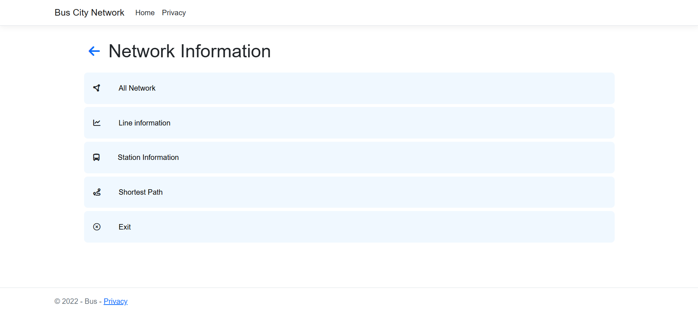
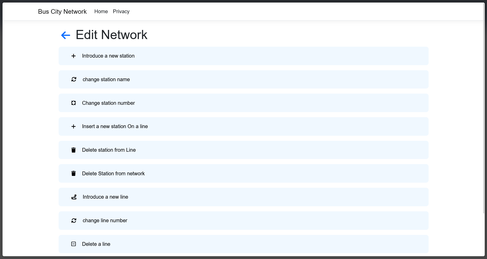
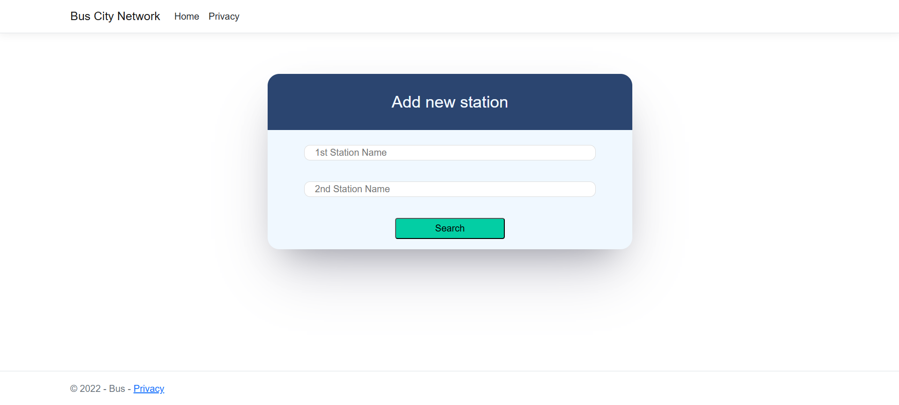

# Bus Network Management System

A comprehensive web-based application for managing a bus network, built using ASP.NET Core Razor Pages. This project leverages custom data structures to efficiently handle stations, bus lines, and pathfinding.

## 🚀 Features

- **Network Configuration**: Add, edit, and delete bus lines and stations within the network.
- **Custom Linked List**: Utilizes a custom-built Doubly Linked List for managing stations on a line, supporting operations like `insertFirst`, `insertBack`, `insertAfter`, and `insertBefore`.
- **Optimal Pathfinding**: Find the most efficient route between two stations across different lines.
- **Admin Dashboard**: A centralized interface for administrators to manage the entire bus network.
- **Data Persistence**: Automatically saves and loads network configurations from JSON files (`network.json` and `stations.json`).
- **Real-time Updates**: Track changes and undo operations before final save.

## 🛠️ Technologies Used

- **Framework**: ASP.NET Core Razor Pages
- **Language**: C#
- **Data Structures**: custom Doubly Linked List
- **Frontend**: HTML5, CSS3, JavaScript, FontAwesome
- **Data Storage**: JSON-based flat files

## 🖼️ Screenshots

| Page | Screenshot |
| --- | --- |
| **Bus Network Info** |  |
| **Edit Network** |  |
| **Add Station** |  |

## �📂 Project Structure

- `Bus/Models/`: Contains the core logic for the network, including:
  - `List.cs` & `node.cs`: Custom generic doubly linked list implementation.
  - `network.cs`: Manages the collection of bus lines.
  - `line.cs`: Defines a bus line as a list of stations.
  - `station.cs`: Memory-efficient station management.
- `Bus/Services/`: Contains `BusService.cs` for data management and persistence.
- `Bus/Pages/`: Razor Pages for the user interface, including dashboards, line info, and search forms.
- `wwwroot/data/`: Stores JSON files for persistence.

## 🏁 Getting Started

### Prerequisites

- [.NET 6.0 SDK](https://dotnet.microsoft.com/download/dotnet/6.0) or later
- [Visual Studio 2022](https://visualstudio.microsoft.com/vs/) or [VS Code](https://code.visualstudio.com/)

### Installation

1. Clone the repository:
   ```bash
   git clone https://github.com/EtsubFikreab/BusNetworkLinkedList.git
   ```
2. Navigate to the project directory:
   ```bash
   cd BusNetworkLinkedList/Bus
   ```
3. Restore dependencies:
   ```bash
   dotnet restore
   ```
4. Run the application:
   ```bash
   dotnet run
   ```
5. Open your browser and navigate to `https://localhost:5001` (or the port specified in your console).

## 🗺️ Usage

1. **Add Stations**: Create new stations with unique IDs and names in the "Add New Station" section.
2. **Create Lines**: Define bus lines and assign sequences of stations to them using the custom linked list logic.
3. **Find Path**: Navigate to the "Shortest Path" section, enter your starting and destination stations, and the system will calculate the optimal route.
4. **Manage Network**: Use the Admin Dashboard to view all networks, edit existing ones, or undo recent changes.

## 📄 License

This project is licensed under the MIT License - see the LICENSE file for details.
